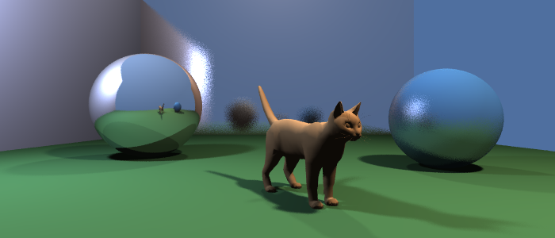

# Raycore.jl

[](https://github.com/JuliaGeometry/Raycore.jl/actions/workflows/ci.yml?query=branch%3Amaster)
[](https://juliageometry.github.io/Raycore.jl/stable/)
[](https://juliageometry.github.io/Raycore.jl/dev/)

High-performance ray-triangle intersection engine with BVH acceleration for CPU and GPU.

## Features

- **Fast BVH acceleration** for ray-triangle intersection
- **CPU and GPU support** via KernelAbstractions.jl
- **Analysis tools**: centroid calculation, illumination analysis, view factors for radiosity
- **Makie integration** for visualization

## Getting Started

```julia
using Pkg
Pkg.add(url="https://github.com/JuliaGeometry/Raycore.jl")
```

### Basic Ray Intersection

```julia
using Raycore, GeometryBasics, LinearAlgebra

# Create geometry
sphere = Tesselation(Sphere(Point3f(0, 0, 2), 1.0f0), 20)

# Build BVH acceleration structure
bvh = BVH([sphere])

# Cast rays and find intersections
ray = Ray(o=Point3f(0, 0, 0), d=Vec3f(0, 0, 1))
hit_found, triangle, distance, bary_coords = closest_hit(bvh, ray)

if hit_found
    hit_point = ray.o + ray.d * distance
    println("Hit at distance $distance: $hit_point")
end
```

### Analysis Features

```julia
# Calculate scene centroid from a viewing direction
viewdir = normalize(Vec3f(0, 0, -1))
hitpoints, centroid = get_centroid(bvh, viewdir)

# Analyze illumination
illumination = get_illumination(bvh, viewdir)

# Compute view factors for radiosity
vf_matrix = view_factors(bvh; rays_per_triangle=1000)
```

## Documentation

- [Full API Documentation](https://juliageometry.github.io/Raycore.jl/)
- [Ray Tracing Tutorial](https://juliageometry.github.io/Raycore.jl/dev/raytracing_tutorial.html) - Build a complete ray tracer from scratch


