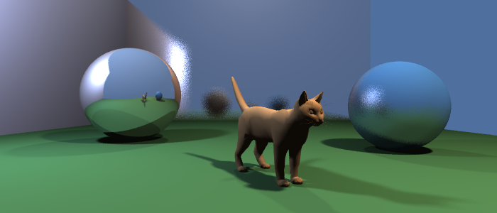
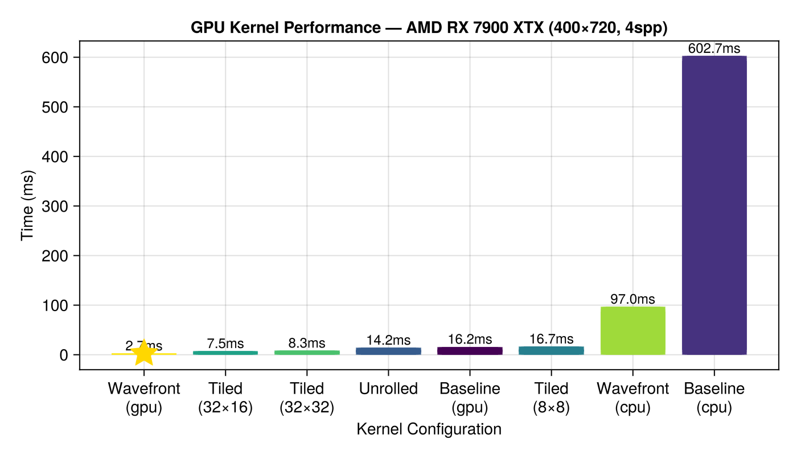

# Raycore.jl

[](https://github.com/JuliaGeometry/Raycore.jl/actions/workflows/ci.yml?query=branch%3Amaster)
[](https://juliageometry.github.io/Raycore.jl/stable/)
[](https://juliageometry.github.io/Raycore.jl/dev/)

High-performance ray-triangle intersection engine with TLAS/BLAS acceleration for CPU and GPU.

## Features

- **Fast TLAS/BLAS acceleration** for ray-triangle intersection
- **CPU and GPU support** via KernelAbstractions.jl
- **MultiTypeSet**: GPU-safe heterogeneous collections with compile-time type-stable dispatch for materials, textures, lights, etc.
- **GPU TLAS**: Two-level acceleration structure (BLAS/TLAS) with instanced geometry, per-instance transforms, and GPU-first design
- **Analysis tools**: centroid calculation, illumination analysis, view factors for radiosity
- **Makie integration** for visualization

## Getting Started

```julia
using Pkg
Pkg.add(url="https://github.com/JuliaGeometry/Raycore.jl")
```

### Basic Ray Intersection

```julia
using Raycore, GeometryBasics, LinearAlgebra

# Create geometry
mesh = normal_mesh(Sphere(Point3f(0, 0, 2), 1.0f0))

# Build TLAS acceleration structure
tlas = TLAS([mesh], (mi, ti) -> UInt32(mi))

# Cast rays and find intersections
ray = Ray(o=Point3f(0, 0, 0), d=Vec3f(0, 0, 1))
hit_found, triangle, distance, bary_coords, instance_id = closest_hit(tlas, ray)

if hit_found
    hit_point = ray.o + ray.d * distance
    println("Hit at distance $distance: $hit_point")
end
```

### Analysis Features

```julia
# Calculate scene centroid from a viewing direction
viewdir = normalize(Vec3f(0, 0, -1))
hitpoints, centroid = get_centroid(tlas, viewdir)

# Analyze illumination
illumination = get_illumination(tlas, viewdir)

# Compute view factors for radiosity
vf_matrix = view_factors(tlas; rays_per_triangle=1000)
```

## Testing

Run tests with `--check-bounds=auto` (not the `Pkg.test` default of `--check-bounds=yes`), because GPU kernels compiled with bounds checking generate SPIR-V that crashes pocl:

```julia
using Pkg
Pkg.test("Raycore"; julia_args=`--check-bounds=auto`)
```

## Documentation

[Full API Documentation](https://juliageometry.github.io/Raycore.jl/)

[Ray Tracing Tutorial](https://juliageometry.github.io/Raycore.jl/dev/raytracing_tutorial.html), build a complete ray tracer from scratch


[GPU Ray Tracing Tutorial](https://juliageometry.github.io/Raycore.jl/dev/gpu_raytracing.html), port the ray tracer to GPU with optimization techniques

