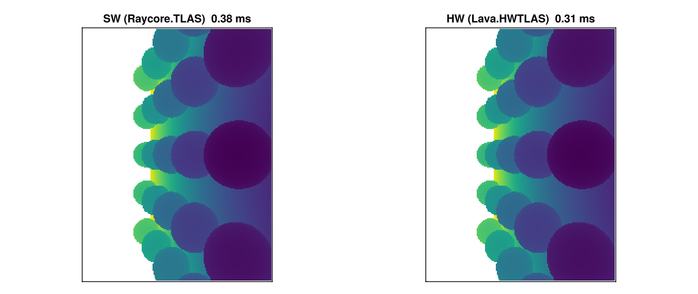

# Hardware Ray Tracing with Lava

Modern GPUs include dedicated ray tracing hardware (RT cores on NVIDIA, Ray Accelerators on AMD) that can traverse BVH structures and test ray-triangle intersections in fixed-function silicon. This tutorial shows how to use hardware acceleration with Raycore via the [Lava.jl](https://github.com/SimonDanisch/Lava.jl) Vulkan backend.

The demo builds the same scene twice — once into a software `Raycore.TLAS`, once into a hardware `Lava.HWTLAS` — traces primary camera rays through both, and verifies the depth buffers agree.

## When to pick `Raycore.TLAS` vs. `Lava.HWTLAS`

|             Aspect |                                        `Raycore.TLAS` |                        `Lava.HWTLAS` |
| ------------------:| -----------------------------------------------------:| ------------------------------------:|
|            Backend |            any KA backend (CUDA, AMDGPU, Metal, Lava) |                Lava + Vulkan RT only |
|                BVH |                       software (BVH4 / instanced BVH) |         `VkAccelerationStructureKHR` |
| Closest-hit kernel | KA `@kernel`, in-line `Raycore.closest_hit(bvh, ray)` | `vkCmdTraceRaysKHR` over a ray batch |
|  Dispatch overhead |                                        low, KA launch |              very low, pre-baked SBT |
|           Use when |     portability / non-Vulkan backend / no RT hardware |       max perf on Vulkan RT hardware |

Both types satisfy `Raycore.AbstractAccel` — `push!`, `delete!`, `update_transform!`, `sync!`, `n_instances`, `n_geometries`, `wait_for_gpu!` work identically. The HW path uses a batched dispatch (`Lava.trace_closest_hits!`) instead of a per-thread `closest_hit` call inside a KA kernel.

## When Hardware RT Helps

Hardware RT gives the biggest speedups on scenes with:

  * **High triangle counts** — RT cores traverse the BVH in fixed-function hardware
  * **Complex occlusion** — interior scenes, overlapping geometry, more traversal steps per ray
  * **Simple shading** — when BVH traversal dominates, not material evaluation

For trivial scenes the software BVH already runs at GPU memory bandwidth, so the win is modest. The demo below uses ~48k triangles which is enough to see HW pull ahead but small enough to fit in a tutorial.

Hardware RT requires a Vulkan-capable GPU with `VK_KHR_ray_tracing_pipeline`. NVIDIA RTX (Turing+), AMD RDNA 2+, and Intel Arc all support it.

## Setup

```julia
using Raycore, GeometryBasics, LinearAlgebra
using Lava
using WGLMakie
using Adapt
import KernelAbstractions as KA
using KernelAbstractions: @kernel, @index, @Const

device = Lava.LavaBackend()
```

**Lava backend active** — Vulkan device with RT support.

`LavaBackend` is a KernelAbstractions backend that compiles `@kernel` code through Lava's SPIR-V compiler. It's also the device that owns Vulkan acceleration structures, so SW and HW share the same GPU context.

## Building a scene twice — software and hardware

Build a small scene of tessellated spheres on a floor — enough triangles for the BVH traversal cost to matter. Both `Raycore.TLAS` and `Lava.HWTLAS` ingest plain `GeometryBasics.Mesh` objects through `push!`, so the same meshes go into both.

```julia
function build_meshes()
    floor = GeometryBasics.normal_mesh(Rect3f(Vec3f(-3, -3, -0.01), Vec3f(6, 6, 0.01)))
    sphere_centers = Point3f[]
    for i in -2:2, j in -2:2
        push!(sphere_centers, Point3f(Float32(i)*0.9f0, Float32(j)*0.9f0, 0.4f0))
    end
    spheres = [GeometryBasics.normal_mesh(Tesselation(Sphere(c, 0.3f0), 32))
               for c in sphere_centers]
    return [floor; spheres]
end

all_meshes = build_meshes()
total_tris = sum(length(GeometryBasics.faces(m)) for m in all_meshes)

sw_tlas = Raycore.TLAS(device)
hwtlas  = Lava.HWTLAS(device)

for (i, m) in enumerate(all_meshes)
    push!(sw_tlas, m)
    push!(hwtlas, m; instance_id=UInt32(i))
end

Raycore.sync!(sw_tlas)
Raycore.sync!(hwtlas)
```

**Scene built**

|                | meshes | instances | triangles |
|---------------:|-------:|----------:|----------:|
| `Raycore.TLAS` |     26 |        26 |    48 062 |
| `Lava.HWTLAS`  |     26 |        26 |    48 062 |

`sync!` uploads the meshes and builds the acceleration structures. For `Raycore.TLAS` that means GPU LBVH builds (one BLAS per mesh + a TLAS over instances). For `Lava.HWTLAS` it means `vkCmdBuildAccelerationStructuresKHR` calls plus instance-table allocation.

## Tracing primary rays both ways

Generate one camera ray per pixel. The SW path uses `Raycore.Ray` (origin + direction), the HW path uses `Raycore.RTRay` (origin + dir + tmin/tmax, 32-byte struct that matches Vulkan's `VkRayTracingShaderRecordKHR` layout).

```julia
const W, H = 256, 192

cam_pos    = Point3f(0, -3.5, 1.6)
cam_target = Point3f(0, 0, 0.3)
cam_up     = Point3f(0, 0, 1)

forward = normalize(cam_target - cam_pos)
right   = normalize(cross(forward, cam_up))
up      = cross(right, forward)
aspect  = Float32(W / H)
focal   = 1.0f0 / tan(deg2rad(45.0f0 / 2))

function build_rays(W, H, cam_pos, forward, right, up, aspect, focal)
    rays_sw = Vector{Raycore.Ray}(undef, W*H)
    rays_hw = Vector{Raycore.RTRay}(undef, W*H)
    for y in 1:H, x in 1:W
        u = (2.0f0 * (Float32(x) - 0.5f0) / Float32(W) - 1.0f0)
        v = (1.0f0 - 2.0f0 * (Float32(y) - 0.5f0) / Float32(H))
        d = normalize(forward * focal + right * (u * aspect) + up * v)
        i = (y - 1) * W + x
        rays_sw[i] = Raycore.Ray(o=cam_pos, d=Vec3f(d))
        rays_hw[i] = Raycore.RTRay(cam_pos[1], cam_pos[2], cam_pos[3], 0f0,
                                    d[1], d[2], d[3], 1f3)
    end
    rays_sw, rays_hw
end

rays_sw, rays_hw = build_rays(W, H, cam_pos, forward, right, up, aspect, focal)

# ---- SW path: KA kernel calls Raycore.closest_hit per pixel
@kernel function depth_kernel_sw!(depth, @Const(bvh), @Const(rays))
    i = @index(Global, Linear)
    @inbounds if i <= length(rays)
        ray = rays[i]
        hit_found, _, dist, _, _ = Raycore.closest_hit(bvh, ray)
        depth[i] = hit_found ? dist : -1f0
    end
end

sw_static    = Adapt.adapt(device, sw_tlas)              # StaticTLAS for kernels
rays_sw_gpu  = Lava.LavaArray(rays_sw)
depth_sw_gpu = Lava.LavaArray(zeros(Float32, W*H))

sw_kernel = depth_kernel_sw!(device, 64)
sw_kernel(depth_sw_gpu, sw_static, rays_sw_gpu, ndrange=W*H)
KA.synchronize(device)
depth_sw = Array(depth_sw_gpu)

# ---- HW path: batched trace_closest_hits! dispatches vkCmdTraceRaysKHR
rays_hw_gpu = Lava.LavaArray(rays_hw)
hits_hw     = Lava.LavaArray(fill(Raycore.RTHitResult(0,0,0,0,0,0,0,0), W*H))

Lava.trace_closest_hits!(hits_hw, rays_hw_gpu, hwtlas.hw_accel, length(rays_hw))
Raycore.wait_for_gpu!(hwtlas)

depth_hw = Float32[h.hit == UInt32(1) ? h.t : -1f0 for h in Array(hits_hw)]

# ---- Compare
hit_mask_sw  = depth_sw .> 0
hit_mask_hw  = depth_hw .> 0
disagree     = count(hit_mask_sw .!= hit_mask_hw)
shared       = hit_mask_sw .& hit_mask_hw
max_abs_diff = maximum(abs.(depth_sw[shared] .- depth_hw[shared]))
```

**Pixel-wise agreement**

- hit-mask disagreement: **0 pixels** out of 49 152
- max abs depth diff on shared hits: **1.29e-5**

Sub-1e-4 tolerance is the expected noise floor — both paths use the same Möller–Trumbore-style intersection but with slightly different rounding (the HW path goes through Vulkan's intersection shader, the SW path through Raycore's kernel).

## How the two paths line up

```
Software BVH (SW):                Hardware RT (HW):
┌──────────────────┐              ┌──────────────────┐
│ KA @kernel       │              │ Build RTRay      │
│  per pixel       │              │   batch          │
│                  │              └────────┬─────────┘
│ Raycore.         │                       │
│   closest_hit(   │              ┌────────▼─────────┐
│     bvh, ray)    │              │ trace_closest_   │
│                  │              │   hits! (one     │
│ writes depth[i]  │              │   vkCmdTraceRays │
└──────────────────┘              │   call)          │
                                  └────────┬─────────┘
                                           │
                                  ┌────────▼─────────┐
                                  │ RTHitResult[]    │
                                  │ — t, prim_id,    │
                                  │   bary, ...      │
                                  └──────────────────┘
```

In the SW path the kernel is fully programmable — anything you can write inside a `@kernel` function (shadow rays, multi-bounce, custom intersection) works the same way. In the HW path the traversal is fixed-function: rays go in as `RTRay`, hit results come out as `RTHitResult`. The raygen / closest-hit / miss shaders are pre-baked and dispatched as one Vulkan call per ray batch.

## Visualize and time

```julia
to_disp(d) = d > 0 ? d : NaN32
img_sw = reshape(depth_sw, W, H) |> permutedims |> x -> to_disp.(x)
img_hw = reshape(depth_hw, W, H) |> permutedims |> x -> to_disp.(x)

# Warm-up + 5-shot minimum timing
function time_sw()
    KA.synchronize(device)
    t = @elapsed begin
        sw_kernel(depth_sw_gpu, sw_static, rays_sw_gpu, ndrange=W*H)
        KA.synchronize(device)
    end
    return t
end

function time_hw()
    Raycore.wait_for_gpu!(hwtlas)
    t = @elapsed begin
        Lava.trace_closest_hits!(hits_hw, rays_hw_gpu, hwtlas.hw_accel, length(rays_hw))
        Raycore.wait_for_gpu!(hwtlas)
    end
    return t
end

time_sw(); time_sw(); time_hw(); time_hw()  # warm
t_sw = minimum(time_sw() for _ in 1:5)
t_hw = minimum(time_hw() for _ in 1:5)

fig = Figure(size=(900, 380))
ax1 = Axis(fig[1, 1], title="SW (Raycore.TLAS)  $(round(t_sw*1000, digits=2)) ms",
           aspect=DataAspect())
ax2 = Axis(fig[1, 2], title="HW (Lava.HWTLAS)  $(round(t_hw*1000, digits=2)) ms",
           aspect=DataAspect())
hidedecorations!(ax1); hidedecorations!(ax2)
heatmap!(ax1, img_sw, colormap=:viridis)
heatmap!(ax2, img_hw, colormap=:viridis)
fig
```



The two heatmaps are visually indistinguishable — the depth comparison cell above quantifies that. The timing ratio depends on triangle count, ray coherence, and GPU; the only honest way to know what your scene needs is to measure both.

## Lifetime and memory management

`sync!(hwtlas)` owns `hwtlas.static_tlas`. Consumers re-read it (or call `Adapt.adapt(backend, hwtlas)`) per dispatch — do NOT cache across mutations.

`sync!` does not block the CPU. Backend-internal timeline tracking (Lava's `bq.deferred_as_frees`) handles the "still in flight" case when old acceleration-structure buffers are dropped. If you need a CPU-blocking drain — e.g. before tear-down or between benchmark phases — call `Raycore.wait_for_gpu!(hwtlas)` explicitly.

## Direct `HWTLAS` usage

The cells above already show the full direct-API path. The minimum is:

```julia
using Raycore, Lava, GeometryBasics, LinearAlgebra
using Raycore: RTRay, RTHitResult

device = Lava.LavaBackend()
hwtlas = Lava.HWTLAS(device)

mesh = GeometryBasics.normal_mesh(Sphere(Point3f(0, 0, 2), 1.0f0))
push!(hwtlas, mesh; instance_id=UInt32(1))
Raycore.sync!(hwtlas)

rays = Lava.LavaArray([RTRay(0,0,5, 0,  0,0,-1, 1f3)])
hits = Lava.LavaArray(fill(RTHitResult(0,0,0,0,0,0,0,0), 1))
Lava.trace_closest_hits!(hits, rays, hwtlas.hw_accel, 1)
Raycore.wait_for_gpu!(hwtlas)
```

`HardwareAccel` (`hwtlas.hw_accel`) is the lower-level handle if you need direct control of the pipeline / SBT or want to install a custom any-hit shader (`Lava.set_anyhit_pipeline!`).

## RT shader intrinsics

If you write your own raygen / closest-hit / miss shaders in Lava, the RT intrinsics use the `lava_rt_*` naming convention — no `accel` argument since the SBT wires up the hardware automatically:

|                      `Raycore.rt_*` (generic) |               `lava_rt_*` (Lava-specific) |
| ---------------------------------------------:| -----------------------------------------:|
|              `Raycore.rt_primitive_id(accel)` |                  `lava_rt_primitive_id()` |
|               `Raycore.rt_instance_id(accel)` |                   `lava_rt_instance_id()` |
|     `Raycore.rt_instance_custom_index(accel)` |         `lava_rt_instance_custom_index()` |
|               `Raycore.rt_launch_id_x(accel)` |                   `lava_rt_launch_id_x()` |
|           `Raycore.rt_trace_ray!(accel, ...)` |                  `lava_rt_trace_ray(...)` |
|       `Raycore.rt_ignore_intersection(accel)` |           `lava_rt_ignore_intersection()` |
| `Raycore.rt_payload_store!(accel, val, slot)` | `lava_rt_payload_store_f32_at(val, slot)` |
|        `Raycore.rt_payload_load(accel, slot)` |       `lava_rt_payload_load_f32_at(slot)` |

The pre-baked shaders shipped with `Lava.HardwareAccel` (raygen / closest-hit / miss for `RTHitResult` payload) are defined in `Lava/src/raytracing/raycore_compat.jl` as a reference implementation.

