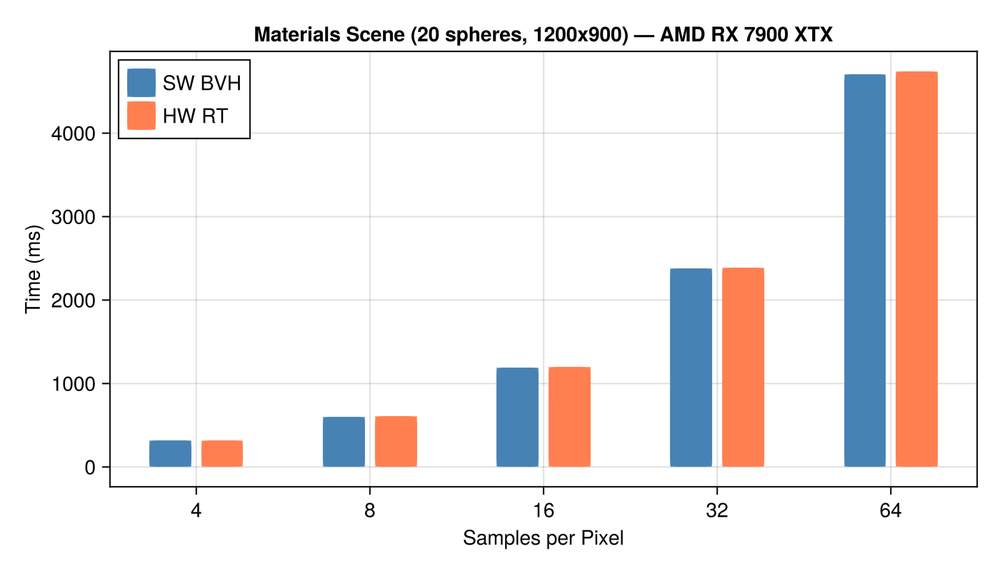
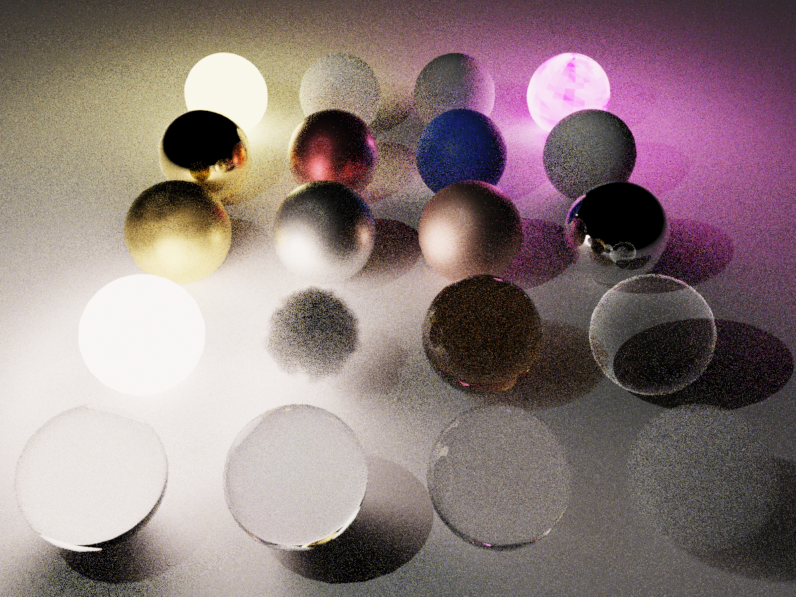

# Hardware-Accelerated Ray Tracing

Modern GPUs include dedicated ray tracing hardware (RT cores on NVIDIA, Ray Accelerators on AMD) that can traverse BVH structures and test ray-triangle intersections in fixed-function silicon. This tutorial shows how to use hardware acceleration with Raycore via the [Lava.jl](https://github.com/SimonDanisch/Lava.jl) Vulkan backend.

## When to Use Hardware RT

Hardware RT gives the biggest speedups on scenes with:
- **High triangle counts** (millions of triangles) — RT cores traverse the BVH in hardware
- **Complex occlusion** (overlapping geometry, interior scenes) — more traversal steps per ray
- **Simple shading** — when BVH traversal is the bottleneck, not material evaluation

For scenes with few triangles or expensive volumetric shading (clouds, subsurface scattering), the software BVH can match or exceed hardware RT because the traversal is a small fraction of total render time.

## Setup

Hardware RT requires a Vulkan-capable GPU with the `VK_KHR_ray_tracing_pipeline` extension. All NVIDIA RTX (Turing+), AMD RDNA 2+, and Intel Arc GPUs support this.

```julia (editor=true, logging=false, output=true)
using Raycore, GeometryBasics, Hikari
using RayMakie, Makie, Colors
using Lava

# Activate RayMakie with the Lava GPU backend
sensor = Hikari.FilmSensor(; iso=50, exposure_time=1.0)
device = Lava.LavaBackend()
RayMakie.activate!(device=device, exposure=0.6f0, tonemap=:aces, gamma=2.2f0, sensor=sensor)
md"**Lava backend active** — using Vulkan for GPU compute + optional hardware RT"
```

## Building a Scene

Scene construction is identical regardless of whether you use software or hardware acceleration. The standard Makie `mesh!` API builds the acceleration structure automatically.

```julia (editor=true, logging=false, output=true)
function create_demo_scene(; resolution=(800, 600))
    lights = [
        PointLight(RGBf(60, 60, 60), Vec3f(8, 8, 10)),
        PointLight(RGBf(20, 20, 20), Vec3f(-2, -6, 3)),
    ]

    scene = Scene(; size=resolution, lights=lights, ambient=RGBf(0.02, 0.02, 0.025))
    cam3d!(scene)

    # Floor
    mesh!(scene, Rect3f(Vec3f(-10, -10, -0.001), Vec3f(20, 20, 0.001));
          material=Hikari.Diffuse(Kd=(0.7, 0.7, 0.7)))

    # A variety of materials
    materials = [
        Hikari.Gold(roughness=0.05),
        Hikari.Silver(roughness=0.02),
        Hikari.Copper(roughness=0.08),
        Hikari.Dielectric(Kt=(1, 1, 1), index=1.5),
        Hikari.Mirror(Kr=(0.95, 0.95, 0.95)),
        Hikari.CoatedDiffuse(reflectance=(0.1, 0.2, 0.7), roughness=0.05),
        Hikari.Plastic(Kd=(0.9, 0.9, 0.3), Ks=(0.5, 0.5, 0.5), roughness=0.1),
        Hikari.Diffuse(Kd=(0.8, 0.2, 0.2)),
    ]

    # Place spheres in a grid
    spacing = 0.7f0
    radius = 0.25f0
    nrows, ncols = 4, 5
    for row in 1:nrows, col in 1:ncols
        x = (col - (ncols + 1) / 2) * spacing
        y = (row - (nrows + 1) / 2) * spacing
        mat = materials[mod1(col + (row - 1) * ncols, length(materials))]
        mesh!(scene, Sphere(Point3f(x, y, radius), radius); material=mat)
    end

    update_cam!(scene, Vec3f(0, -5.5, 2), Vec3f(0, 0, 0), Vec3f(0, 0, 1))
    return scene
end

scene = create_demo_scene()
md"**Scene ready** — 20 spheres with metals, glass, plastics, and diffuse materials"
```

## Software BVH (Default)

By default, Raycore uses a GPU software BVH (LBVH with Morton codes, two-level TLAS/BLAS). This works on any GPU backend — Lava, AMDGPU, CUDA, Metal, OpenCL.

```julia (editor=true, logging=false, output=true)
# Software BVH (default)
integrator_sw = Hikari.VolPath(samples=16, max_depth=20, hw_accel=false)
img_sw = @time colorbuffer(scene; backend=RayMakie, integrator=integrator_sw)
img_sw
```

The software BVH traverses the acceleration structure in a compute kernel — each GPU thread walks the BVH tree, tests ray-AABB intersections at internal nodes, and ray-triangle intersections at leaves.

## Hardware RT Acceleration

Enable hardware RT by setting `hw_accel=true`. This builds a Vulkan acceleration structure from the same scene geometry and uses the GPU's dedicated RT hardware for BVH traversal and intersection testing.

```julia (editor=true, logging=false, output=true)
# Hardware RT — same scene, same API, just flip the flag
integrator_hw = Hikari.VolPath(samples=16, max_depth=20, hw_accel=true)
img_hw = @time colorbuffer(scene; backend=RayMakie, integrator=integrator_hw)
img_hw
```

The rendered images are identical — hardware RT is a transparent acceleration of the BVH traversal, not a different rendering algorithm. All materials, volumetrics, and lighting work exactly the same.

## How It Works Under the Hood

When `hw_accel=true`:

1. **Build phase**: Scene geometry (from `mesh!` calls) is compiled into Vulkan acceleration structures (BLAS per mesh, TLAS over instances) using `VK_KHR_acceleration_structure`
2. **Trace phase**: Instead of software BVH traversal, rays are batched and dispatched via `VK_KHR_ray_tracing_pipeline` with raygen/closest-hit/miss shaders
3. **Result phase**: Hit results (distance, triangle ID, barycentrics) are written to a GPU buffer, then consumed by the shading kernels

The key insight: only the **traversal** changes. Material evaluation, volumetric sampling, shadow rays, and film accumulation all run the same KernelAbstractions compute kernels regardless of SW/HW mode.

```
Software BVH:          Hardware RT:
┌──────────────┐       ┌──────────────┐
│ Ray Generation│       │ Ray Generation│
│  (compute)   │       │  (compute)   │
└──────┬───────┘       └──────┬───────┘
       │                      │
┌──────▼───────┐       ┌──────▼───────┐
│ BVH Traversal│       │ Extract Rays │
│ + Intersection│       │ to RT Buffer │
│  (compute)   │       └──────┬───────┘
└──────┬───────┘              │
       │               ┌──────▼───────┐
       │               │ HW RT Trace  │
       │               │ (RT pipeline)│
       │               └──────┬───────┘
       │                      │
┌──────▼───────┐       ┌──────▼───────┐
│   Shading    │       │   Shading    │
│  (compute)   │       │  (compute)   │
└──────────────┘       └──────────────┘
```

## Performance Comparison

On scenes with simple geometry (20 spheres), software and hardware RT perform similarly — the BVH traversal is a small fraction of total render time:



Hardware RT gives larger speedups on complex scenes:

| Scene | Triangles | SW BVH | HW RT | Speedup |
|-------|-----------|--------|-------|---------|
| Materials (20 spheres) | ~2K | 740ms | 760ms | 1.0x |
| Crown (pbrt-v4) | 3.5M | 2.4s | 1.8s | 1.3x |

**Why the modest speedup?** Hikari is a volumetric path tracer — most render time is spent on material evaluation, medium sampling, and shadow rays, not BVH traversal. For pure ray casting (no shading), hardware RT can be 10-20x faster than software BVH on large scenes.

## Scaling to Complex Scenes

Hardware RT shines on production scenes with millions of triangles. Here is the [pbrt-v4 Crown scene](https://pbrt.org/scenes-v4) (3.5M triangles, 786 meshes, volumetric gems):



The 20-material showcase above renders in **740ms at 10spp** on an AMD RX 7900 XTX — competitive with CUDA on an RTX 3070.

## API Summary

```julia
# Software BVH (default, works on any KA backend)
integrator = Hikari.VolPath(samples=N, hw_accel=false)

# Hardware RT (requires Lava + VK_KHR_ray_tracing_pipeline)
integrator = Hikari.VolPath(samples=N, hw_accel=true)

# Both use the same scene and rendering API
img = colorbuffer(scene; backend=RayMakie, integrator=integrator)
```

The `hw_accel` flag is the only API difference. Scene construction, camera setup, materials, and all other parameters are identical.
