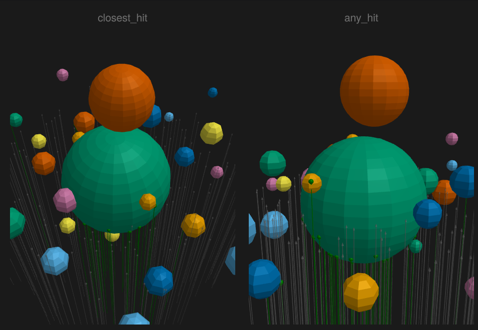
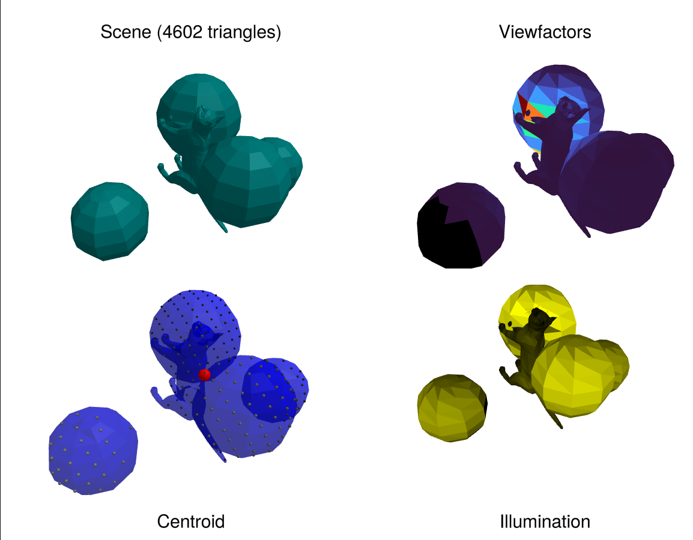

# Raycore.jl

High-performance ray-triangle intersection engine with BVH acceleration for CPU and GPU.

## Features

- **Fast BVH acceleration** for ray-triangle intersection
- **CPU and GPU support** via KernelAbstractions.jl
- **Analysis tools**: centroid calculation, illumination analysis, view factors for radiosity
- **Makie integration** for visualization

## Interactive Examples

### BVH Hit Tests & Basics

Learn the basics of ray-triangle intersection, BVH construction, and visualization.



[BVH Hit tests](@ref)

### Ray Tracing Tutorial

Build a complete ray tracer from scratch with shadows, materials, reflections, and tone mapping.


[Ray Tracing with Raycore](@ref)

### View Factors Analysis

Calculate view factors, illumination, and centroids for radiosity and thermal analysis.



[View Factors and More](@ref)


## Overview


```@autodocs
Modules = [Raycore]
Order   = [:module, :constant, :type, :function, :macro]
Public  = true
Private = false
```

## Private Functions

```@autodocs
Modules = [Raycore]
Order   = [:module, :constant, :type, :function, :macro]
Public  = false
Private = true
```
